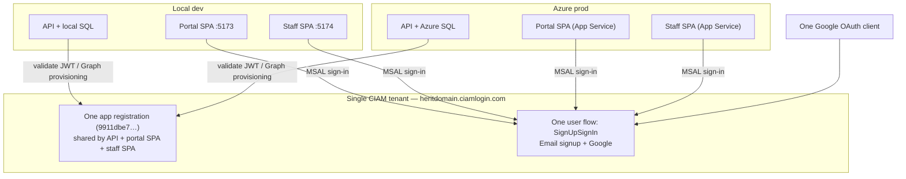
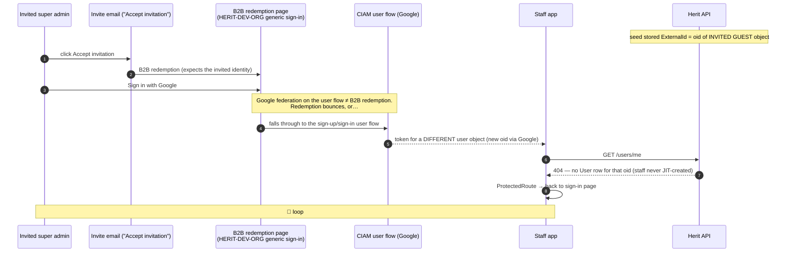
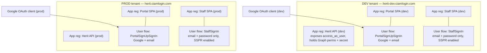
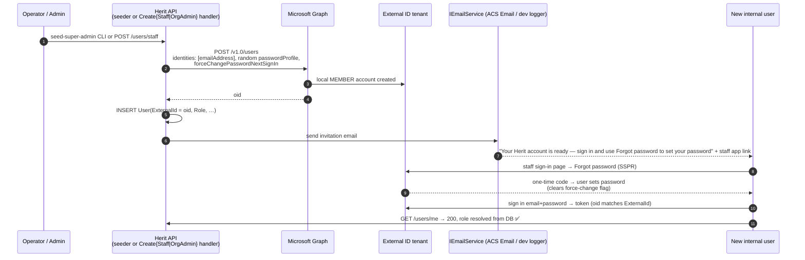

# Herit — Authentication Strategy: Untangling Staff & Portal Identity

**Status:** Proposed · **Date:** 2026-07-20 · **Decision record:** [ADR-020](../decisions/ADR-020-identity-separation-and-invitation-flow.md)

This document describes the current identity architecture and its problems, the target
architecture, and a sequenced plan (with a GitHub-issue breakdown) to get there.

Related reading: [authentication-authorization.md](authentication-authorization.md)
(detailed flow walkthroughs of the current system), ADR-013/014/015.

---

## 1. Current architecture and its problems

### 1.1 Topology today

One Entra External ID (CIAM) tenant, one app registration, and one sign-up/sign-in user
flow serve **both audiences** (staff + portal) in **both environments** (local dev +
Azure prod):

Authorization is unaffected by any of this: roles live in the Herit DB and are resolved
per request (ADR-014). The problems below are purely **authn/provisioning** problems.

### 1.2 Problem A — internal-user provisioning uses the wrong Graph primitive

`EntraExternalIdIdentityProviderService.CreateUserAsync` calls **`POST /invitations`**,
the Entra **B2B guest invitation** API. B2B invitations never offer a "set your
password" step — redemption federates to the invitee's *existing* IdP. The desired UX
(invite email → set password → sign in with email+password) is unachievable with this
API regardless of tenant topology.

It also produces the observed **redirect loop** for the seeded super admin:

Two independent failures compound: (1) redemption and the user flow are different
mechanisms, and Google on the user flow does not satisfy redemption; (2) even when a
Google sign-in succeeds, its `oid` differs from the invited-guest `oid` stored as
`User.ExternalId`, so the role gate rejects the user.

### 1.3 Problem B — staff and portal share one registration and one user flow

- Staff see "Sign in with Google", which is only meaningful for self-registering expats,
  and there is no email+password-first experience for provisioned users.
- Redirect URIs, scopes, and token settings for both SPAs are entangled on one
  registration.
- A single sign-in experience cannot be tuned per audience (branding, SSPR, providers).

### 1.4 Problem C — dev and prod share one tenant

- Throwaway dev identities live next to production identities; a bad delete or
  misconfigured user flow in "dev" is a prod incident.
- Email uniqueness is tenant-wide: the same email cannot be seeded in dev and prod.
- The dev client secret can touch the production directory.

### 1.5 Problem D — latent prod config gap

`infra/main.bicep` surfaces `entra-client-id/-tenant-id/-authority/-tenant` as
`AzureAd__*` app settings, but there is **no `AzureAd__ClientSecret` app setting**; the
Key Vault secret `entra-client-secret` loads under the config key `entra-client-secret`,
not `AzureAd:ClientSecret`, which is what `EntraExternalIdIdentityProviderService`
reads. Prod provisioning/seeding would fail even after Problems A–C are fixed.

---

## 2. Target architecture

Per [ADR-020](../decisions/ADR-020-identity-separation-and-invitation-flow.md):
**one tenant per environment; separate app registrations and user flows per audience;
local-account provisioning with an app-sent invitation email.**

Key properties:

- **2 tenants, not 4.** External ID associates user flows with specific app
  registrations, so audience isolation does not require separate tenants. The only cost
  of co-tenancy is tenant-wide email uniqueness (one address can't be both a staff local
  account and a portal account in the same environment) — accepted for MVP, revisit if
  staff-who-are-also-expats becomes real.
- **API registration is the token audience for both SPAs** (both request
  `api://<api-client-id>/access_as_user`), so API token validation stays single-audience
  and `CurrentUserService`/role resolution are untouched.
- **2 Google OAuth clients** (dev, prod) — each tenant's federation endpoint
  (`https://<tenant>.ciamlogin.com/<tenant>.onmicrosoft.com/federation/oauth2`) is a
  distinct redirect URI and credential boundary.

### 2.1 Target internal-user provisioning flow

`POST /invitations` is replaced by Graph **`POST /users`** creating a **local account**,
plus an application-sent invitation email. SSPR ("Forgot password") is the credential
set-up mechanism, so no temporary password is ever transmitted.

Portal/expat flows (Google self-sign-up, JIT `User` creation per ADR-015) are unchanged
except for pointing at the new tenant, portal registration, and portal user flow.

Known residual quirk: External ID user flows are always *sign-up and sign-in*, so a
stranger could self-create an idle local account via the staff flow. They get no access
(no `User` row is ever JIT-created for staff; ADR-014 gate denies), but directory
hygiene may need occasional cleanup.

---

## 3. Next steps — how to get there

Sequenced to get a **working dev environment first**, then replicate to prod:

1. **Stand up the dev tenant** (new External ID tenant, dev Google OAuth client +
   federation, three app registrations, two user flows, SSPR, Graph permissions).
2. **Fix the code against the dev tenant**: local-account provisioning, invitation
   email abstraction, per-app MSAL/auth configuration, dev appsettings/env files.
3. **Fix infra-as-code**: Bicep `AzureAd__ClientSecret` mapping, new parameters (staff
   client id, ACS connection), setup-script updates.
4. **Validate the full loop in dev**: seed → invite email → SSPR set password → super
   admin signs in → provisions an org admin/staff → that user onboards → deprovision.
5. **Provision the prod tenant + ACS Email**, update GitHub/Key Vault secrets, deploy,
   re-validate in prod.
6. **Update docs** (`authentication-authorization.md`, ops runbooks) to match reality.

The existing setup script (`scripts/setup-entra-external-id.sh`) and the
Key-Vault/`azd` parameterisation already anticipate per-environment secrets, so most of
the infra work is portal clicks plus re-running the script per tenant.

---

## Appendix — Proposed GitHub issues (in delivery order)

Legend — **CodeChange**: deliverable by Claude Code against this repo.
**InfraChange**: manual configuration in Azure / Google Cloud / GitHub.

| # | Type | Title | Description |
|---|------|-------|-------------|
| 1 | InfraChange | Provision dedicated DEV Entra External ID tenant | 1. In the Azure Portal (subscription with permission to create tenants): **Microsoft Entra External ID → Manage tenants → Create → External** tenant. Name it e.g. `herit-dev`, note the resulting domain (`herit-dev.onmicrosoft.com`) and **Tenant ID** GUID. 2. Sign in to the new tenant (`az login --tenant <dev-tenant-id> --allow-no-subscriptions`) and confirm you hold Global Admin. 3. Record for later issues: tenant id, domain, authority `https://herit-dev.ciamlogin.com`. No app objects yet — that's issue 3. |
| 2 | InfraChange | Create DEV Google OAuth client and federate it into the dev tenant | 1. In Google Cloud Console → APIs & Services → Credentials → **Create credentials → OAuth client ID** (type: Web application), name `herit-dev-portal`. 2. Add authorized redirect URI: `https://herit-dev.ciamlogin.com/herit-dev.onmicrosoft.com/federation/oauth2`. 3. Copy client ID + secret. 4. In the dev tenant: **External Identities → All identity providers → Add → Google**, paste the client ID/secret. 5. Verify Google appears under identity providers. (Prod gets its own client in issue 9 — do not reuse this one.) |
| 3 | InfraChange | Create app registrations, user flows and SSPR in the DEV tenant | 1. Run `./scripts/setup-entra-external-id.sh --tenant-id <dev-tenant-id> …` to create the **Herit API** registration and client secret (copy the secret **Value** immediately). 2. Manually add two more registrations (App registrations → New): **Herit Portal SPA** (platform: SPA; redirect URIs `http://localhost:5173` for now) and **Herit Staff SPA** (SPA; `http://localhost:5174`). 3. On the API registration: Expose an API → scope `access_as_user`; API permissions → Microsoft Graph **application** permission `User.ReadWrite.All` → **Grant admin consent** (this replaces `User.Invite.All`). 4. On each SPA registration: API permissions → delegated `access_as_user` on the Herit API → grant admin consent. 5. User flows → New: **PortalSignUpSignIn** (sign up and sign in; providers: Email signup + Google; attributes: Display Name) and **StaffSignIn** (providers: **Email with password only** — no Google). 6. Associate each flow with its app: open the user flow → **Applications → Add application** (portal flow ↔ Portal SPA, staff flow ↔ Staff SPA). 7. Enable self-service password reset for local accounts (External Identities → password reset settings) and verify the staff flow's sign-in page shows "Forgot password?". 8. Record: API client id + secret, portal SPA client id, staff SPA client id. |
| 4 | CodeChange | Replace B2B invitation with Graph local-account creation | In `src/Herit.Infrastructure/Services/EntraExternalIdIdentityProviderService.cs`, rewrite `CreateUserAsync` to call `POST /v1.0/users` instead of `POST /invitations`: build a `User` with `AccountEnabled = true`, `DisplayName`, `Mail`, `Identities = [{ SignInType = "emailAddress", Issuer = "<tenant-domain-from-config>", IssuerAssignedId = email }]`, `PasswordProfile = { Password = <cryptographically random, meets complexity>, ForceChangePasswordNextSignIn = true }`, `PasswordPolicies = "DisablePasswordExpiration"`; return the created object id. Add `AzureAd:Domain` (tenant domain) to the service's required config; remove the `InviteRedirectUrl` requirement from this class (it moves to the email content, issue 5). Never log or return the random password. Update `LocalTestIdentityProviderService` only if its interface changes. Update unit tests and `docs/ops/super-admin-bootstrap.md` (Graph permission is now `User.ReadWrite.All`, not `User.Invite.All`; email is sent by the app, not Entra). |
| 5 | CodeChange | Add IEmailService and send internal-user invitation emails | Add `IEmailService` in `Herit.Application` with `SendInternalUserInvitationAsync(email, displayName, ct)`. Implementations in `Herit.Infrastructure`: (a) `AcsEmailService` using `Azure.Communication.Email` (config: `Email:AcsConnectionString`, `Email:SenderAddress`); (b) `LoggingEmailService` that logs the full email body — registered when no ACS connection string is configured (Development default). Email content: subject "You've been invited to Herit"; body explains the account is ready, links to the staff app URL (config `AzureAd:InviteRedirectUrl`, keep the existing key), and instructs the user to click **Forgot password?** on the sign-in page to set their password. Invoke it after successful `CreateUserAsync` in `SuperAdminSeeder`, `CreateStaffUserCommandHandler`, and `CreateOrganisationAdminCommandHandler`. Email failure must not roll back user creation — log a warning containing remediation guidance instead. Unit-test handler wiring with a mocked `IEmailService`. |
| 6 | CodeChange | Split SPA auth configuration (staff app gets its own registration) | Frontend: give the staff app its own MSAL client id — `frontend/staff` reads `VITE_AZURE_CLIENT_ID` (staff SPA registration) while `frontend/portal` keeps its own value (portal SPA registration); both keep authority + `knownAuthorities` from env. Both apps continue to request scope `api://<API-client-id>/access_as_user`, so introduce `VITE_AZURE_API_CLIENT_ID` (or a full scope env var) and use it in both apps' token requests; API-side validation config is unchanged (audience remains the API registration). Update `.env.example` files for both apps, `docs/ops/entra-external-id-setup.md` (three registrations, two user flows, flow-to-app association), and extend `scripts/setup-entra-external-id.sh` to create/patch the two SPA registrations idempotently (SPA platform redirect URIs per app instead of shared). |
| 7 | CodeChange | Point local dev at the DEV tenant | Update `src/Herit.Api/appsettings.Development.json`: `AzureAd:Instance = https://herit-dev.ciamlogin.com`, `Domain = herit-dev.onmicrosoft.com`, new dev `TenantId`, `ClientId` (API registration), keep `InviteRedirectUrl = http://localhost:5174`; `ClientSecret` stays out of the file (user-secrets: `dotnet user-secrets set "AzureAd:ClientSecret" "<value>"`, document the command). Update both frontends' dev env files with the dev authority and their respective new client ids. Update `docs/architecture/authentication-authorization.md` config matrix. Acceptance: `--seed-super-admin` against the dev tenant creates the Entra local account + DB row and logs/sends the invitation email. |
| 8 | CodeChange | Fix Bicep secret mapping and add new deploy parameters | In `infra/main.bicep`: (a) add app setting `AzureAd__ClientSecret` as a Key Vault reference to `entra-client-secret` (fixes the config-key mismatch — the service reads `AzureAd:ClientSecret` but the vault secret loads as `entra-client-secret`); (b) add `AzureAd__Domain` and `AzureAd__InviteRedirectUrl` (staff app URL) app settings; (c) add parameters + Key Vault secrets for the portal SPA client id, staff SPA client id (surfaced to the SPA builds as `VITE_AZURE_CLIENT_ID` per app and `VITE_AZURE_API_CLIENT_ID`), and `Email__AcsConnectionString` / `Email__SenderAddress`; (d) wire the corresponding GitHub Actions workflow env/secret pass-through in `main.parameters.json` and the deploy workflow. Acceptance: `azd provision --preview`/what-if renders cleanly; a config dump on the deployed API shows `AzureAd:ClientSecret` populated. |
| 9 | InfraChange | Provision PROD Entra External ID tenant + PROD Google OAuth client | Repeat issues 1–3 for prod: create the `herit` (prod) external tenant; create a **separate** Google OAuth client `herit-prod-portal` with redirect URI `https://herit.ciamlogin.com/herit.onmicrosoft.com/federation/oauth2` and federate it; run the setup script against the prod tenant; create the three registrations, two user flows (flow-to-app associations), SSPR, and grant admin consent for Graph `User.ReadWrite.All`. SPA redirect URIs: the deployed portal/staff URLs from `azd env get-values` (`SERVICE_WEB_URI`, `SERVICE_STAFF_URI`). Record all prod ids + the API client secret **Value** for issue 11. |
| 10 | InfraChange | Provision Azure Communication Services Email + sender domain | 1. Create an **Azure Communication Services** resource and an **Email Communication Services** resource in the prod resource group. 2. Add a domain: start with the free **Azure managed domain** (instant, `donotreply@<guid>.azurecomm.net`) — a custom domain (SPF/DKIM DNS records) can follow later. 3. Connect the domain to the ACS resource (Email → Domains → Connect). 4. Copy the ACS connection string (Keys blade) and the sender address (`MailFrom` of the provisioned domain). 5. Store as GitHub secrets `ACS_EMAIL_CONNECTION_STRING` and `ACS_EMAIL_SENDER` for issue 11 / the deploy pipeline. |
| 11 | InfraChange | Update GitHub secrets and Key Vault for the PROD tenant | 1. In the GitHub repo → Settings → Secrets and variables → Actions, replace/set: `ENTRA_TENANT_ID`, `ENTRA_CLIENT_ID` (prod API registration), `ENTRA_CLIENT_SECRET` (secret **Value**, not Secret ID), `ENTRA_AUTHORITY` (`https://herit.ciamlogin.com`), `ENTRA_TENANT` (`herit.onmicrosoft.com`), plus new `ENTRA_PORTAL_SPA_CLIENT_ID`, `ENTRA_STAFF_SPA_CLIENT_ID`, `ACS_EMAIL_CONNECTION_STRING`, `ACS_EMAIL_SENDER` (names must match issue 8's workflow wiring). 2. Run the deploy workflow so Bicep writes the Key Vault secrets and app settings. 3. Restart the API App Service. 4. Verify in the App Service → Environment variables that `AzureAd__ClientSecret` resolves (Key Vault reference shows green). |
| 12 | CodeChange | End-to-end validation + documentation refresh | Add/execute a validation checklist and update docs to match the shipped state. Dev + prod: (1) run `--seed-super-admin`, confirm invitation email, complete SSPR, sign in to staff app, confirm `/users/me` 200 with SuperAdmin; (2) super admin creates an org admin and a staff user via the staff app; both onboard via the same email/SSPR path; (3) portal: fresh Google account self-registers, JIT `User(Expat)` row created, CompleteProfile flow works; (4) deprovision a staff user — Entra account and DB row both removed; (5) confirm a stranger self-signing-up via the staff flow gets `/access-denied` and no data. Update `docs/architecture/authentication-authorization.md`, `docs/ops/super-admin-bootstrap.md`, and `docs/ops/entra-external-id-setup.md` to describe the two-tenant, three-registration, local-account architecture; mark ADR-020 **Accepted**. Fix anything the checklist surfaces. |
