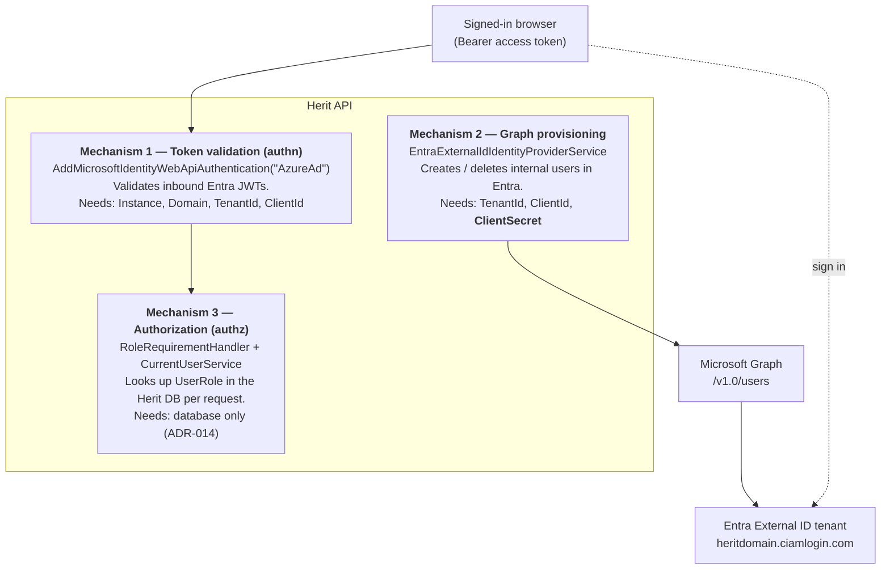
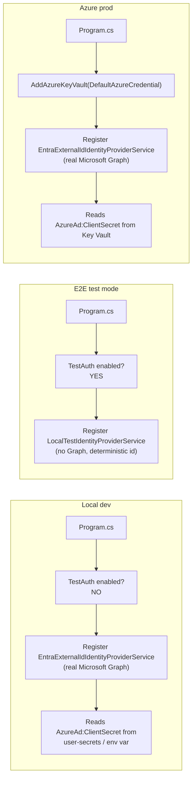
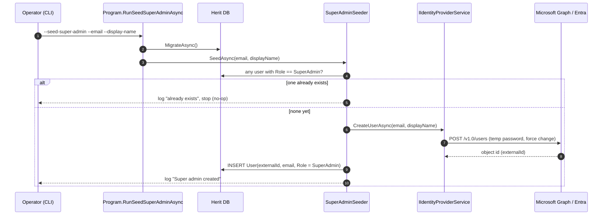
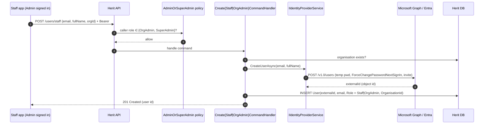
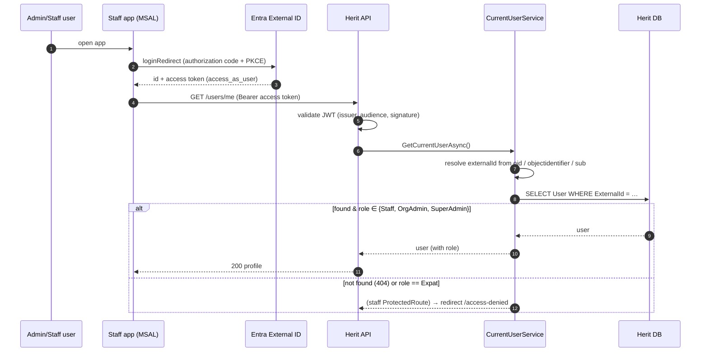
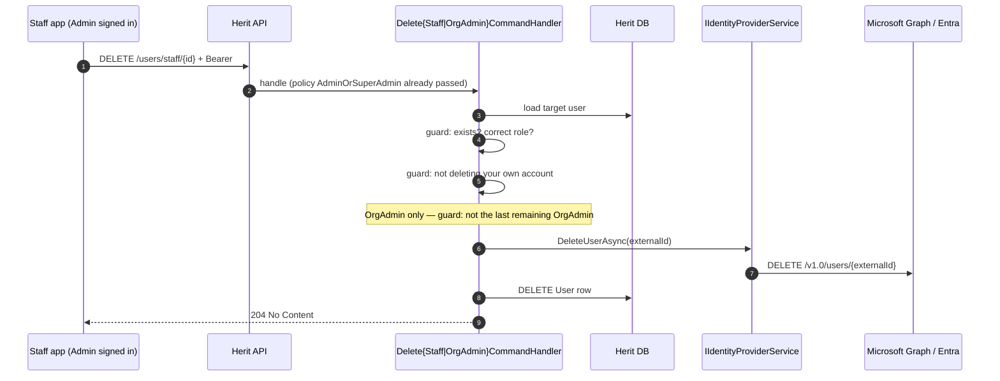
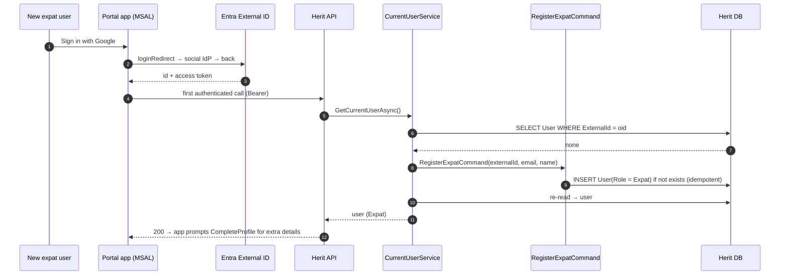
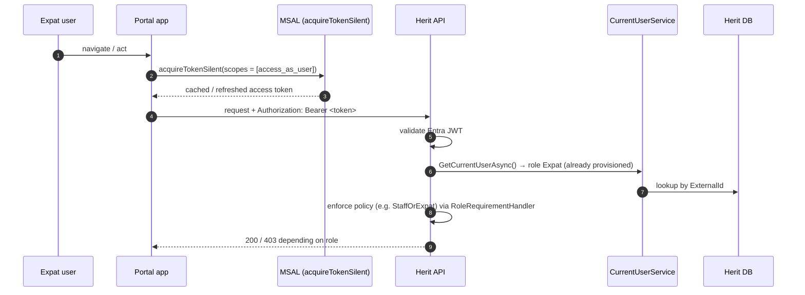
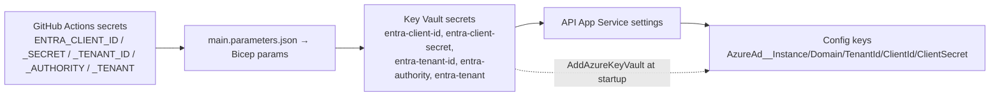

# Herit — Authentication & Authorization Architecture

**Status:** Living document · **Last updated:** 2026-07-20

This document explains the full identity architecture of Herit and walks through six
flows — super-admin creation, admin/staff provisioning, admin/staff authn/authz,
admin/staff de-provisioning, portal user sign-up, and portal user authn/authz — in
both the **local dev** and **Azure production** environments. Every claim below is
grounded in the code paths cited inline.

---

## 1. The big picture

Herit uses **Microsoft Entra External ID** (CIAM — the successor to Azure AD B2C) as
its single identity provider for every user population (ADR-013). One Entra tenant holds
**three app registrations** — one per deployable — so each SPA has its own client id and
redirect URIs, while both mint API tokens against the shared API registration:

| Piece | App registration | Identity role |
|---|---|---|
| **Portal app** (`frontend/portal`) | **Herit Portal SPA** (own client id) | Public/expat-facing SPA. MSAL browser sign-in (Google). |
| **Staff app** (`frontend/staff`) | **Herit Staff SPA** (own client id) | Internal SPA for Staff / Org Admin / Super Admin (email + password). |
| **Herit API** (`src/Herit.Api`) | **Herit API** (holds the client secret) | Validates Entra JWTs; resolves roles from its own database; provisions internal users into Entra via Microsoft Graph. |

Each SPA reads its own registration's client id as `VITE_AZURE_CLIENT_ID`, and both build
the requested scope in code as `api://${VITE_AZURE_API_CLIENT_ID}/access_as_user` against
the **API** registration. API-side token validation is unchanged — the audience is always
the API registration.

Two distinct identity mechanisms live in the API and are easy to confuse — the whole
error you hit lives in the difference between them:



- **Mechanism 1** (`Program.cs:35`) only needs the *public* Entra coordinates. This is
  what lets a signed-in user call the API.
- **Mechanism 2** (`EntraExternalIdIdentityProviderService`) authenticates to Microsoft
  Graph with a **client secret** (`ClientSecretCredential(tenantId, clientId, clientSecret)`)
  to create/delete internal user accounts. **This is the only place a client secret is
  required — and it is the piece failing in your `--seed-super-admin` run.**
- **Mechanism 3** never touches Entra: roles live in the Herit database and are resolved
  on every request by looking up the `User` row via the token's object-id claim
  (ADR-014).

### Roles

`UserRole` (`src/Herit.Domain/Enums/UserRole.cs`) is a four-value enum: `SuperAdmin`,
`OrganisationAdmin`, `Staff`, `Expat`. Roles are **not** carried in the token — they are
stored only in Herit's DB and resolved per request.

---

## 2. Environment configuration matrix

The same code runs in every environment; only configuration changes. This is the single
most important table for understanding your error.

| Setting | Local dev (`Development`) | Azure prod (`Production`) | E2E (`E2E`) |
|---|---|---|---|
| Config source | `appsettings.Development.json` + **user-secrets / env vars** | `appsettings.json` + **Azure Key Vault** (`AddAzureKeyVault`, `Program.cs:26`) | `appsettings.E2E.json` |
| `AzureAd:Instance` | `https://heritdomain.ciamlogin.com` | KV secret `entra-authority` | placeholder |
| `AzureAd:TenantId` | `72b4b7c4-cf1b-45c6-923b-771539cb809c` | KV secret `entra-tenant-id` | zeros |
| `AzureAd:ClientId` (API registration) | `9911dbe7-a96f-4ed8-8ec4-8f458e2cd10e` | KV secret `entra-client-id` | zeros |
| `AzureAd:ClientSecret` | **NOT in any file — supply via user-secrets: `dotnet user-secrets set "AzureAd:ClientSecret" "<value>"`** | KV secret `entra-client-secret`, surfaced as app setting `AzureAd__ClientSecret` (see §9) | not used |
| Portal SPA `VITE_AZURE_CLIENT_ID` | `ebed2da3-07d1-4d42-aa6d-db668d1b1d78` | KV secret `entra-portal-spa-client-id` → build env | E2E placeholder |
| Staff SPA `VITE_AZURE_CLIENT_ID` | `855f1553-b976-4535-a611-75cd1648cd67` | KV secret `entra-staff-spa-client-id` → build env | E2E placeholder |
| Both SPAs `VITE_AZURE_API_CLIENT_ID` | `9911dbe7-a96f-4ed8-8ec4-8f458e2cd10e` | Bicep output from `entra-client-id` | E2E placeholder |
| Identity provider impl | **`EntraExternalIdIdentityProviderService` (real Graph)** | `EntraExternalIdIdentityProviderService` (real Graph) | `LocalTestIdentityProviderService` (in-memory stub) |
| Auth scheme | Real Entra JWT bearer | Real Entra JWT bearer | `TestAuth` symmetric JWT |
| `TestAuth:Enabled` | **false** (not set) | false (blocked in Production regardless) | true |

The trap: **local dev is not a "fake auth" environment.** Unless you explicitly run in
E2E mode, `AddInfrastructure` (`DependencyInjection.cs:23`) registers the *real*
`EntraExternalIdIdentityProviderService`, which calls the real Microsoft Graph against
the shared `heritdomain` tenant and therefore needs a real, valid client secret.

> **✅ Recommended future task — separate Entra tenants per environment.** If dev and
> prod currently share one Entra tenant, migrate to a dedicated tenant per environment
> (dev / prod, and ideally staging). Benefits: real production identities never mix with
> throwaway test users; the blast radius of a bad delete, misconfigured user flow, or
> leaked dev secret is contained to one environment; destructive testing in dev is safe;
> and each tenant owns its own app registration, client secret, social-IdP credentials,
> and user-flow settings. It also **eliminates the email-uniqueness collision described in
> §3** — the same super-admin email can exist independently in each tenant. Cost: two
> tenants to provision and maintain, the app registered and secret-managed twice, and each
> social identity provider configured in both. The infra already anticipates this — Entra
> ClientId/secret are externalized per `azd` environment — so the main work is provisioning
> the second tenant and pointing each environment's secrets at it.



---

## 3. Super-admin creation

Super-admin is bootstrapped from the CLI, not from any UI:

```bash
dotnet run --project src/Herit.Api -- --seed-super-admin \
  --email abbas.pirnia@gmail.com --display-name "Super Admin"
```

`Program.cs:20` intercepts `--seed-super-admin` *before* the web host is built and runs
`RunSeedSuperAdminAsync`: it builds a minimal host, applies EF migrations, resolves
`SuperAdminSeeder`, and calls `SeedAsync`. The seeder is **idempotent** — if any
`SuperAdmin` already exists it logs and returns without doing anything
(`SuperAdminSeeder.cs`).



### Local dev vs Azure prod for this flow

```mermaid
flowchart TB
    subgraph LD["Local dev"]
        L1["dotnet run -- --seed-super-admin"]
        L1 --> L2["Config: appsettings.Development.json<br/>+ AzureAd:ClientSecret from user-secrets/env"]
        L2 --> L3["EntraExternalIdIdentityProviderService"]
        L3 --> L4["ClientSecretCredential(72b4b7c4…, 9911dbe7…, SECRET)"]
        L4 --> L5["Microsoft Graph → heritdomain tenant"]
        L5 --> L6["INSERT into LOCAL SQL"]
    end
    subgraph PR["Azure prod (one-off job)"]
        P1["Run the same command as a one-off container/job<br/>with the App Service identity"]
        P1 --> P2["Config from Key Vault via AddAzureKeyVault"]
        P2 --> P3["EntraExternalIdIdentityProviderService"]
        P3 --> P4["ClientSecretCredential(prod tenant/client/secret)"]
        P4 --> P5["Microsoft Graph → prod CIAM tenant"]
        P5 --> P6["INSERT into Azure SQL"]
    end
```



The only differences are **where config comes from** (user-secrets/env vs Key Vault) and
**which SQL database** is written. In both cases the seeder makes a **real Graph call**
that requires a valid client secret with permission to create users.

### Why your run failed — `AADSTS7000215`

```
AADSTS7000215: Invalid client secret provided. Ensure the secret being sent in the
request is the client secret value, not the client secret ID.
```

This error is raised by Entra when `EntraExternalIdIdentityProviderService` tries to get
a Graph token. The chain is:

1. Development doesn't enable `TestAuth`, so the **real** Graph-backed identity provider
   is registered.
2. `appsettings.Development.json` intentionally contains **no `ClientSecret`**, so the
   value you ran with came from user-secrets or an environment variable.
3. Entra rejected that value. Per the message itself, the near-certain cause is that the
   configured `AzureAd:ClientSecret` is the **Secret ID** (the GUID shown in the portal's
   "Certificates & secrets" list) rather than the **secret Value** (shown only once, at
   creation time). Other possibilities: the secret has expired, or it belongs to a
   different app registration than `ClientId 9911dbe7…`.

**Fix:** in the Entra admin center → your app registration → *Certificates & secrets* →
create a new client secret, copy the **Value** column immediately, and set it via
user-secrets:

```bash
cd src/Herit.Api
dotnet user-secrets set "AzureAd:ClientSecret" "<the-secret-VALUE-not-the-id>"
```

Also confirm the secret belongs to app `9911dbe7-a96f-4ed8-8ec4-8f458e2cd10e` and that
this app has Graph **application permission** `User.ReadWrite.All` (admin-consented) so
it can create users.

### Post-seed sign-in UX (current gap)

A successful seed creates the Entra account and the `User` row — but **it does not give
anyone a way to sign in.** `CreateUserAsync` sets a random, in-process temporary password
(`Guid…"Aa1!"`) with `ForceChangePasswordNextSignIn = true`, and that password is **never
logged, returned, or emailed**. There is also **no invitation flow**: the code creates a
*local account* directly rather than using the Graph `/invitations` API, and Entra does
not auto-send credentials for programmatically created local accounts. (Confirmed: there
is no email/SMTP/notification code anywhere in the repo.)

Consequences and the realistic way in:

- Because the temporary password is discarded, the force-change first-sign-in path is
  unusable — the seeded user doesn't know the password.
- The practical entry path is the **"Forgot password?" / self-service password reset
  (SSPR)** flow on the CIAM sign-in page: the user enters their email, Entra emails a
  one-time code, and they set a new password (which also clears the force-change flag).
  **This works only if SSPR is enabled on the Entra External ID user flow** — verify this
  in the tenant; it is not provable from the repo.
- If SSPR is not enabled, the fallbacks are manual: an admin resets the password in the
  Entra admin center (or via Graph) and shares it out-of-band, or SSPR is enabled on the
  user flow.

**Options to close the gap** (future work): enable SSPR and document "seed → use Forgot
Password" as the intended flow; surface the generated temporary password from the seeder
(e.g. log it in Development or return it to the CLI); or move internal-user creation to an
email-verification / invitation-based flow so Entra sends the sign-in link itself. The
same gap applies to admin/staff provisioning (§4), which uses the identical code path.

---

## 4. Admin / staff provisioning

Staff and Organisation Admins are **created top-down** by an existing admin — there is no
self-registration for internal users. The staff app calls the API:

- `POST /api/v1/users/staff` → `CreateStaffUserCommand`
- `POST /api/v1/users/organisation-admins` → `CreateOrganisationAdminCommand`

Both endpoints are guarded by `[Authorize(Policy = "AdminOrSuperAdmin")]`
(`UsersController.cs`). Each handler validates the target organisation, creates the Entra
account through Graph, then inserts the `User` row with the correct role and
`OrganisationId`.



**Local dev vs prod:** identical code path. Dev hits the shared `heritdomain` CIAM tenant
using the dev client secret and writes to local SQL; prod hits the prod CIAM tenant using
the Key-Vault secret and writes to Azure SQL. In E2E mode only, the Graph call is replaced
by `LocalTestIdentityProviderService`, which returns a deterministic `e2e-<email>` id and
never contacts Entra.

---

## 5. Admin / staff authn / authz

Internal users sign in through the **staff app** (MSAL), receive an Entra access token for
scope `api://<clientId>/access_as_user`, and every API call carries it as a Bearer token.
The API validates the token (Mechanism 1) and then resolves the caller's role from the
database (Mechanism 3). Crucially, staff/admin accounts are **never JIT-created** — if no
`User` row exists for the signed-in identity, access is denied.



Front-end gate: `frontend/staff/src/routes/ProtectedRoute.tsx` explicitly redirects to
`/access-denied` when the `/users/me` lookup 404s or returns an `Expat`. There is
deliberately **no "complete profile" branch** here, because internal users are provisioned,
not JIT-registered (ADR-015).

Back-end gate: endpoints use policies (`SuperAdmin`, `OrganisationAdmin`, `Staff`,
`AdminOrSuperAdmin`, `StaffOrExpat`) declared in `Program.cs`. Each maps to a
`RoleRequirement`; `RoleRequirementHandler` calls `CurrentUserService.GetCurrentUserAsync()`
and succeeds only if the DB role is in the allowed set. Role changes therefore take effect
immediately, with no token refresh needed (ADR-014).

**Local dev vs prod:** same validation and role-lookup logic. Only the token issuer
(dev vs prod CIAM tenant) and the target database differ. In E2E, the `TestAuth` scheme
validates a symmetric-key JWT minted by the Playwright harness instead of an Entra token
(`TestAuthentication.cs`); it carries the same `oid`/`email`/`name` claims so everything
downstream is unchanged.

---

## 6. Admin / staff de-provisioning

De-provisioning is the mirror of provisioning and is likewise admin-only:

- `DELETE /api/v1/users/staff/{id}` → `DeleteStaffUserCommand`
- `DELETE /api/v1/users/organisation-admins/{id}` → `DeleteOrganisationAdminCommand`

Both delete the Entra account via Graph **and** the Herit `User` row, behind guard rails.



Guards in the handlers: you cannot delete your own account (`ForbiddenException`), the
target must actually have the expected role, and the **last remaining Organisation Admin
cannot be deleted** (`ConflictException`). Same code in dev and prod; only tenant and
database differ. In E2E, `DeleteUserAsync` is a no-op stub.

---

## 7. Portal user sign-up (expat)

Expat users are **not** provisioned and there is **no registration endpoint** (ADR-015).
They sign in with social login (Google, etc.) via Entra External ID, and their `User` row
is created **just-in-time** on their first authenticated API request.



The JIT insert lives in `CurrentUserService.GetCurrentUserAsync()`: when the external id
resolves but no `User` row exists, it dispatches `RegisterExpatCommand`, which derives
`Email`/`FullName` from the token claims and inserts an `Expat` row. The handler re-checks
existence first, so concurrent first requests are safe (ADR-015). The portal then routes
the user to `CompleteProfilePage` to capture nationality, location, expertise, and terms
acceptance.

**Local dev vs prod:** identical. The only difference is which CIAM tenant fronts the
social login and which database receives the row. No client secret is involved in this
flow at all — expat sign-up never calls Graph.

---

## 8. Portal user authn / authz

Steady-state portal requests look like this:



Token attachment is centralised in `frontend/portal/src/api/client.ts`: an Axios request
interceptor calls `acquireTokenSilent` and adds the Bearer header when an account is
signed in; if silent acquisition fails it proceeds without a header so public endpoints
still work. MSAL is configured in `frontend/portal/src/auth/msalConfig.ts` from the
`VITE_AZURE_*` env vars (client id, authority, redirect uri), with the CIAM host added to
`knownAuthorities` so MSAL trusts the non-standard `*.ciamlogin.com` authority.

Authorization is again a pure DB role check (Mechanism 3) — expats are limited to the
`Expat` / `StaffOrExpat` policies.

**Local dev vs prod:** the portal points at different `VITE_AZURE_*` values (dev CIAM
tenant + `localhost:5173` redirect vs the deployed CIAM tenant + the Azure Static/App
Service URL, emitted by `infra/main.bicep` outputs). The API validation and role logic are
identical.

---

## 9. Production infrastructure wiring (and one caveat to verify)

At deploy time (`infra/main.bicep`), the API App Service is configured entirely from Key
Vault. GitHub Actions passes the Entra values (`ENTRA_CLIENT_ID`, `ENTRA_CLIENT_SECRET`,
etc. as repo secrets) into Bicep params, which are stored as Key Vault secrets and surfaced
to the app:



App settings in Bicep bind the AzureAd keys via Key Vault references:
`AzureAd__Instance` → `entra-authority`, `AzureAd__Domain` → `entra-tenant`,
`AzureAd__TenantId` → `entra-tenant-id`, `AzureAd__ClientId` → `entra-client-id`, and
`AzureAd__ClientSecret` → `entra-client-secret`. Bicep also binds
`Email__AcsConnectionString` → `email-acs-connection-string` and stores the two SPA client
ids (`entra-portal-spa-client-id`, `entra-staff-spa-client-id`) for the frontend builds.
Separately, `Program.cs:26` calls `AddAzureKeyVault`, which loads **all** vault secrets
into configuration at startup.

> **✅ ClientSecret mapping (previously a caveat, now fixed).** The client **secret** is
> stored as Key Vault secret `entra-client-secret`. The generic `AddAzureKeyVault` default
> would map it to the config key `entra-client-secret`, **not** to `AzureAd:ClientSecret`
> (the default manager only turns a `--` double-dash into a `:`), and
> `EntraExternalIdIdentityProviderService` reads `AzureAd:ClientSecret`. Bicep therefore now
> adds an explicit `AzureAd__ClientSecret` app setting referencing the vault secret, so prod
> provisioning / de-provisioning / super-admin seeding resolve the secret correctly. Token
> *validation* (sign-in) never used the secret and was always unaffected.

---

## 10. Quick reference — where each thing lives

| Concern | File |
|---|---|
| CLI entrypoint + seed super-admin | `src/Herit.Api/Program.cs` |
| Super-admin seeder | `src/Herit.Application/Seeding/SuperAdminSeeder.cs` |
| Graph-backed identity provider (needs secret) | `src/Herit.Infrastructure/Services/EntraExternalIdIdentityProviderService.cs` |
| E2E identity stub | `src/Herit.Infrastructure/Services/LocalTestIdentityProviderService.cs` |
| Identity provider DI registration | `src/Herit.Infrastructure/DependencyInjection.cs` |
| Token validation setup | `src/Herit.Api/Program.cs` (`AddMicrosoftIdentityWebApiAuthentication`) |
| Role resolution + JIT expat | `src/Herit.Api/Services/CurrentUserService.cs` |
| Authorization policies + handler | `src/Herit.Api/Authorization/*`, `Program.cs` |
| E2E test auth scheme | `src/Herit.Api/Authentication/TestAuthentication.cs` |
| Provisioning / de-provisioning commands | `src/Herit.Application/Features/User/Commands/*` |
| User endpoints | `src/Herit.Api/Controllers/UsersController.cs` |
| Portal MSAL config + token attach | `frontend/portal/src/auth/msalConfig.ts`, `src/api/client.ts` |
| Staff route guard | `frontend/staff/src/routes/ProtectedRoute.tsx` |
| Prod identity wiring | `infra/main.bicep` |
| Decisions | ADR-013 (Entra), ADR-014 (DB role resolution), ADR-015 (JIT expat) |
