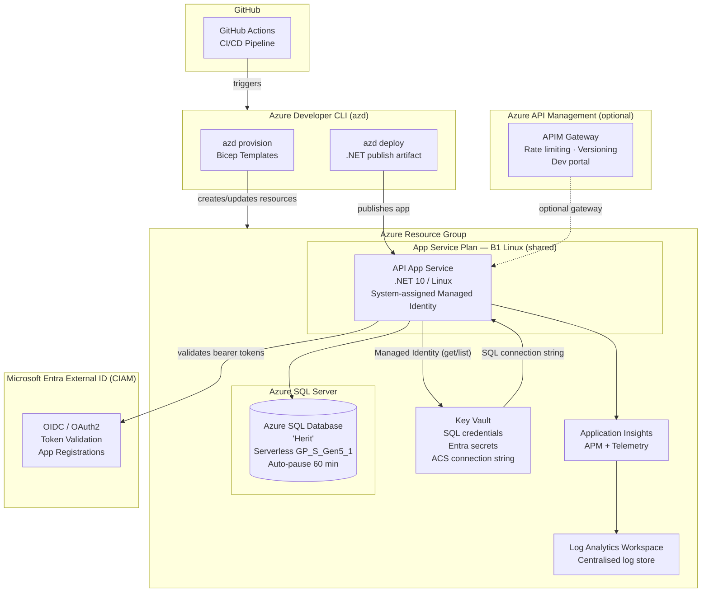
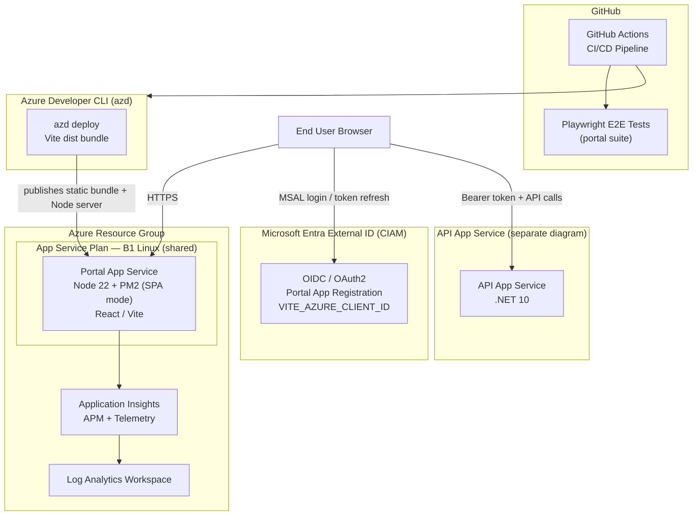
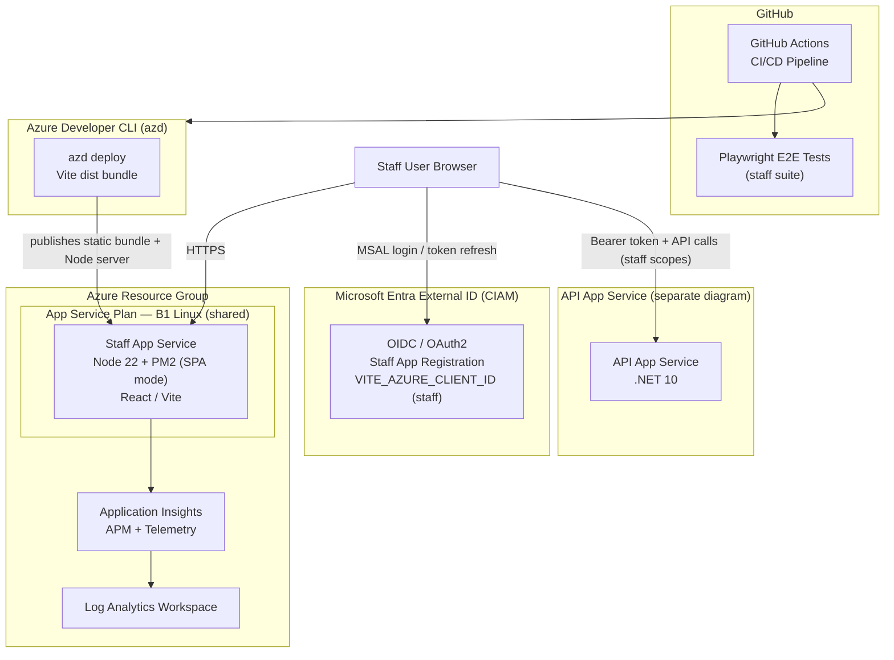
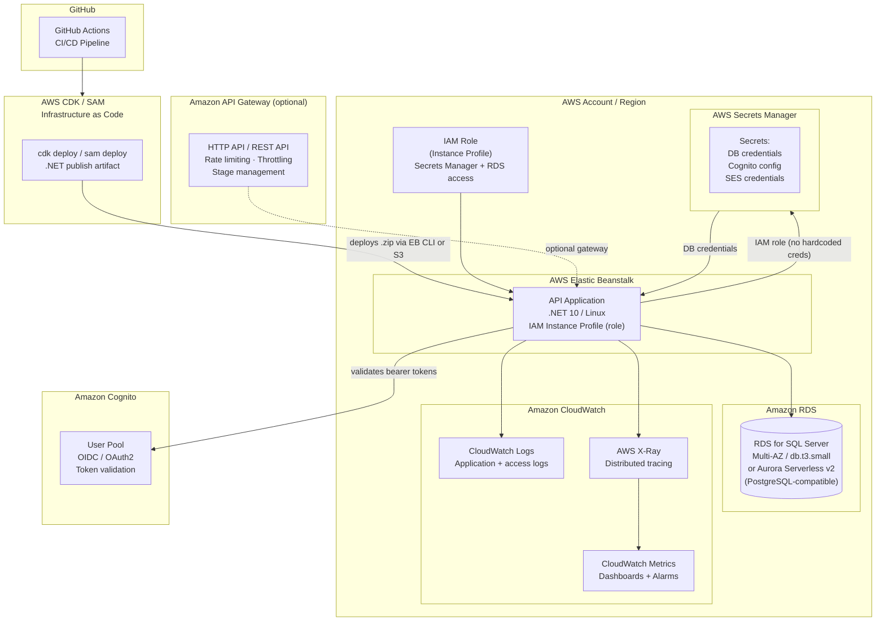
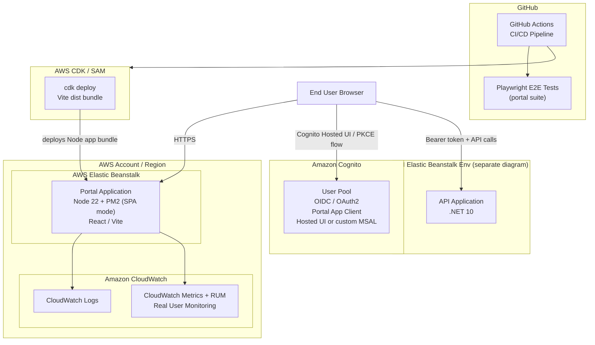
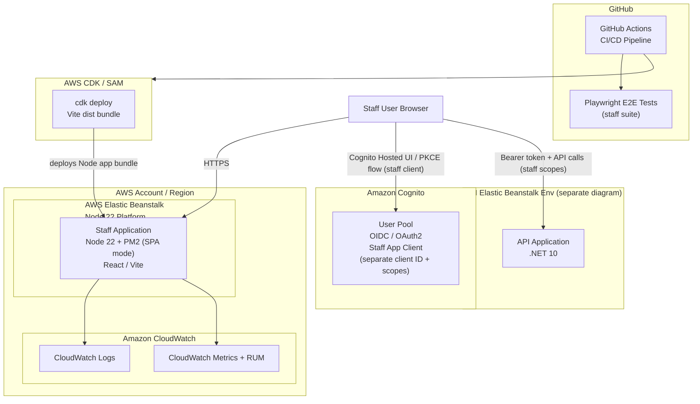

# Deployment Architecture: Azure and AWS

This document describes the current Azure deployment architecture for each Herit application (API, Portal, Staff), followed by equivalent diagrams showing how the same stack would be deployed on AWS, and a service-mapping table at the end.

All three applications share a common set of infrastructure resources — a single App Service Plan, Key Vault, Azure SQL instance, Application Insights workspace, and Log Analytics Workspace — and are deployed together via the Azure Developer CLI (`azd`) from a single GitHub Actions pipeline.

---

## Table of Contents

1. [Azure Architecture](#azure-architecture)
   - [API Application](#azure--api-application)
   - [Portal Application](#azure--portal-application)
   - [Staff Application](#azure--staff-application)
2. [AWS Equivalent Architecture](#aws-equivalent-architecture)
   - [API Application](#aws--api-application)
   - [Portal Application](#aws--portal-application)
   - [Staff Application](#aws--staff-application)
3. [Azure to AWS Service Mapping](#azure-to-aws-service-mapping)

---

## Azure Architecture

### Azure — API Application

The API is a .NET 10 ASP.NET Core application running on a Linux App Service. It uses a system-assigned managed identity to pull secrets from Key Vault at runtime, communicates with an Azure SQL Serverless database, and emits telemetry to Application Insights.

**Key points:**
- Managed Identity eliminates hardcoded credentials; the API fetches all secrets from Key Vault at startup.
- Azure SQL is configured as Serverless (auto-pauses after 60 min of inactivity) to reduce cost in non-production environments.
- Verbose App Service logging (application logs, failed-request tracing, HTTP logs) feeds into Application Insights and Log Analytics.
- APIM is an optional overlay — disabled by default, enabled via the `useAPIM` Bicep parameter.

---

### Azure — Portal Application

The Portal is a React SPA (Vite build) served by Node 22 + PM2 on a Linux App Service. It authenticates users via MSAL against Microsoft Entra External ID (CIAM) and calls the API using the resulting bearer token.

**Key points:**
- PM2 in SPA mode serves the pre-built Vite bundle and forwards all unknown paths to `index.html` (client-side routing).
- MSAL runs entirely in the browser; the Portal App Service itself does not proxy API requests.
- `VITE_*` environment variables (API base URL, Entra client ID, redirect URI) are injected at `azd deploy` time.
- Application Insights SDK is embedded in the SPA for front-end telemetry (page views, JS errors, dependency calls).

---

### Azure — Staff Application

The Staff app is structurally identical to the Portal but uses a separate Entra app registration and a different redirect URI, giving staff users an isolated authentication context with distinct permissions.

**Key points:**
- Separate Entra app registration means staff tokens carry different claims/scopes from portal tokens, allowing the API to enforce role-based access control.
- The Staff App Service sits on the same App Service Plan as the Portal and API, reducing hosting cost.
- E2E test suite runs in parallel with the portal suite in CI.

---

## AWS Equivalent Architecture

The AWS diagrams below show how to replicate the same deployment topology using native AWS services. The mapping philosophy is:

- **App Services** → **AWS Elastic Beanstalk** (managed PaaS, supports .NET and Node, handles auto-scaling and patching)  
  *Alternatively:* AWS App Runner (simpler, container-based) or Amazon ECS Fargate (more control)
- **Azure SQL Serverless** → **Amazon RDS for SQL Server** with Multi-AZ and serverless-like auto-scaling via RDS Serverless on Aurora (requires schema-compatible migration to PostgreSQL/MySQL) or RDS SQL Server with scheduled stop/start
- **Key Vault** → **AWS Secrets Manager**
- **Application Insights + Log Analytics** → **Amazon CloudWatch** (Logs, Metrics, Application Signals, X-Ray)
- **Entra External ID (CIAM)** → **Amazon Cognito** (User Pools + Identity Pools)
- **App Service Plan** → **Elastic Beanstalk Environment** (shared across apps via separate environments in one application)
- **Optional APIM** → **Amazon API Gateway** (REST API or HTTP API)
- **GitHub Actions** stays the same; `azd` is replaced with **AWS CDK** or **AWS SAM** for IaC

---

### AWS — API Application

---

### AWS — Portal Application

> **Alternative for pure SPA hosting:** If the Node/PM2 server is only serving static files, replace Elastic Beanstalk with **Amazon S3 + CloudFront**. S3 holds the Vite build output and CloudFront handles HTTPS, caching, and SPA path rewrites via a CloudFront Function. This is cheaper and scales automatically — the tradeoff is losing any server-side logic PM2 might handle.

---

### AWS — Staff Application

> **Alternative for pure SPA hosting:** Same as Portal — use **Amazon S3 + CloudFront** if PM2 is only doing static file serving.

---

## Azure to AWS Service Mapping

| Azure Service | Role in Herit | AWS Equivalent | Notes |
|---|---|---|---|
| **App Service Plan** (B1 Linux) | Shared compute tier for all three App Services | **AWS Elastic Beanstalk** environment | EB handles OS patching, auto-scaling, and health checks. Alternatively, **AWS App Runner** for a more serverless feel. |
| **API App Service** (.NET 10, Linux) | Hosts the ASP.NET Core backend | **AWS Elastic Beanstalk** (.NET on Linux platform) | Alternatively: **AWS App Runner** (container-based) or **Amazon ECS Fargate** |
| **Portal App Service** (Node 22 + PM2) | Hosts the expat-facing React SPA | **AWS Elastic Beanstalk** (Node.js platform) | If serving only static files: **Amazon S3 + CloudFront** or **AWS Amplify Hosting** |
| **Staff App Service** (Node 22 + PM2) | Hosts the staff/admin React SPA | **AWS Elastic Beanstalk** (Node.js platform) | Same alternative as Portal: **S3 + CloudFront** or **AWS Amplify Hosting** |
| **Azure SQL Database** (Serverless GP_S_Gen5_1) | Relational database with auto-pause | **Amazon RDS for SQL Server** (db.t3.micro/small) | RDS doesn't auto-pause like Azure Serverless; use scheduled stop/start for dev. For true serverless: **Aurora Serverless v2** (requires migrating to PostgreSQL/MySQL). |
| **Azure SQL Server** (logical server) | Host for the Azure SQL Database | **Amazon RDS instance** | RDS bundles the instance and database; no separate "server" resource. |
| **Azure Key Vault** | Stores secrets: SQL credentials, Entra config, email | **AWS Secrets Manager** | Secrets Manager supports automatic rotation and IAM-based access. Alternatively: **AWS Systems Manager Parameter Store** (SecureString) for simpler/cheaper needs. |
| **System-assigned Managed Identity** | Allows API to access Key Vault without credentials | **IAM Role** (attached to Elastic Beanstalk EC2 instance profile or App Runner task role) | IAM roles are the direct equivalent — no stored credentials, just policy-based access. |
| **Application Insights** | APM, distributed tracing, front-end telemetry | **Amazon CloudWatch Application Signals** + **AWS X-Ray** | X-Ray handles distributed tracing; CloudWatch Application Signals provides APM dashboards. CloudWatch RUM covers front-end telemetry. |
| **Log Analytics Workspace** | Central log aggregation and query engine | **Amazon CloudWatch Logs** + **Log Insights** | CloudWatch Log Insights is the equivalent of KQL queries in Log Analytics. |
| **Azure Monitor Dashboards** | Optional portal dashboard for key metrics | **Amazon CloudWatch Dashboards** | Direct equivalent — both support custom metric widgets and log queries. |
| **Microsoft Entra External ID (CIAM)** | Customer identity: OIDC/OAuth2 login for expat users | **Amazon Cognito User Pools** | Cognito User Pools support OIDC, OAuth2 PKCE, hosted UI, and custom domains. Alternatively: **Auth0** or **AWS IAM Identity Center** for staff. |
| **Entra App Registrations** | Per-app OAuth2 client IDs and scopes | **Cognito App Clients** | Each SPA gets its own App Client with distinct callback URLs and allowed scopes. |
| **Azure API Management** (optional) | Gateway: rate limiting, versioning, dev portal | **Amazon API Gateway** (HTTP API or REST API) | HTTP API is lower-cost and lower-latency; REST API supports usage plans, API keys, and a developer portal equivalent. |
| **Azure Resource Group** | Logical container scoping all project resources | **AWS Resource Groups** + tagging strategy | AWS doesn't enforce a hard resource group boundary; tags (`Environment`, `Project`) replicate the scoping. CDK stacks provide logical grouping in IaC. |
| **Azure Developer CLI (azd)** | Developer-friendly IaC deploy tool (`azd up`) | **AWS CDK** or **AWS SAM** | CDK is the closest equivalent for defining and deploying full stacks from code. SAM is simpler but Lambda/serverless-focused. |
| **GitHub Actions** (CI/CD) | Builds, tests, and deploys all three apps | **GitHub Actions** (unchanged) | GitHub Actions works natively with AWS via `aws-actions/configure-aws-credentials`. No service replacement needed. |
| **Azure Deployment Scripts** (SQL user setup) | Runs sqlcmd during provisioning to configure DB users | **AWS Lambda** (custom resource in CDK) or **AWS Systems Manager Run Command** | CDK custom resources backed by Lambda can run one-time provisioning logic during `cdk deploy`. |
