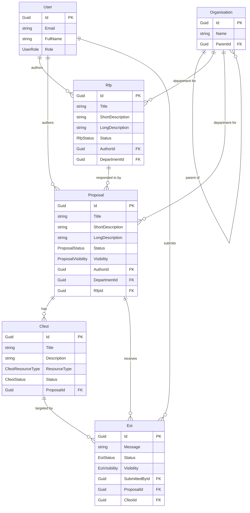

# Entity Relationship Diagram

```mermaid
erDiagram
    User {
        Guid Id PK
        string Email
        string FullName
        UserRole Role
    }

    Organisation {
        Guid Id PK
        string Name
        Guid ParentId FK
    }

    Rfp {
        Guid Id PK
        string Title
        string ShortDescription
        string LongDescription
        RfpStatus Status
        Guid AuthorId FK
        Guid DepartmentId FK
    }

    Proposal {
        Guid Id PK
        string Title
        string ShortDescription
        string LongDescription
        ProposalStatus Status
        ProposalVisibility Visibility
        Guid AuthorId FK
        Guid DepartmentId FK
        Guid RfpId FK
    }

    Cfeoi {
        Guid Id PK
        string Title
        string Description
        CfeoiResourceType ResourceType
        CfeoiStatus Status
        Guid ProposalId FK
    }

    Eoi {
        Guid Id PK
        string Message
        EoiStatus Status
        EoiVisibility Visibility
        Guid SubmittedById FK
        Guid ProposalId FK
        Guid CfeoiId FK
    }

    Organisation ||--o{ Organisation : "parent of"
    User ||--o{ Rfp : "authors"
    Organisation ||--o{ Rfp : "department for"
    User ||--o{ Proposal : "authors"
    Organisation ||--o{ Proposal : "department for"
    Rfp ||--o{ Proposal : "responded to by"
    Proposal ||--o{ Cfeoi : "has"
    Proposal ||--o{ Eoi : "receives"
    User ||--o{ Eoi : "submits"
    Cfeoi ||--o{ Eoi : "targeted by"
```
